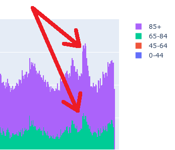

# More StatCan!

The Canadian government has a statistics agency aptly named "Statistics Canada" ("StatCan" for short).  Their data is in the form of data cubes, and available for public RESTful consumption. 

StatCan has over 5700 cubes, each with up to 10 dimensions. Each coordinate (in the 10-dimensional space) is called a vector; and it is a time series for that specific measure.  For example, the population estimate (`productId=17100005`) has 3 dimensions (Province, Sex, Age). You can pull the most recent 10 years for (Ontario, Both Sexes, 0-14) vector with 

```
curl https://www150.statcan.gc.ca/t1/wds/rest/getDataFromCubePidCoordAndLatestNPeriods -v -H "Content-Type: application/json" -d "[{\"productId\":17100005, \"coordinate\":\"7.1.91.0.0.0.0.0.0.0\", \"latestN\": 10}]" 
```


This project pulls a few vectors from those cubes.


## Execution

This program is very simple, albeit verbose: It is best you use it to understand how the pull StatCan data. Do not use it as an example on how to use Pandas.

Windows instructions
```
git clone https://github.com/klahnakoski/mo-statcan.git
cd mo-statcan
pip install -r requirements.txt
set PYTHONPATH=.;vendor
python pull_data.py
```

Even though this code is using Ontario, it can be easily changed to pull data for any province, or for all of Canada. 


## Example - COVID-19

Let's use StatCan data to examine the mortality of COVID-19.  As per statcan.gc.ca, we can see the large number of deaths from the COVID-19 epidemic:


> Above is an April 2021 Snapshot of https://www150.statcan.gc.ca/n1/pub/71-607-x/71-607-x2020017-eng.htm


There are a couple other items to notice:

* Mortality "seasons" are usually measured from July to July to better capture the winter flu; that was not done here.
* Each year appears to have higher mortality than the previous. What is happening there?

### Weekly Mortality

To better explain the statcan.gc.ca chart, I wrote code to pull data from StatCan data cubes.  Here is the same information, unrolled and split into age cohorts: 


> Every StatCan data cube can be accessed by productId on the web: It provides some simple navigation options, and it is an easy way to read important footnotes.  Here is the one for this mortality chart: https://www150.statcan.gc.ca/t1/tbl1/en/tv.action?pid=1310076801

The above is a stacked bar chart; each cohort is stacked atop the younger, so that the total mortality for all ages is the top of the purple (85+) bar.  We can see the COVID-19 spike surpass the 2500 deaths per week, just like in the first chart.  We can also clearly see the upward trend in morality over time.  I have no doubt that Ontario's increasing population is to blame:

### Population Growth

The population estimates are for July 1 of each year


> You can see the same population data here: https://www150.statcan.gc.ca/t1/tbl1/en/tv.action?pid=1710000501

Clearly, the Ontario population is increasing.  The next step was to use these estimates to interpolate the population throughout the year.  We will make straight-line estimates to get 


### Mortality Rate

We can use the population in each cohort to find the mortality rate for each week. I multiplied the mortality rate by the July 1 2020 population estimate for easier comparison to the raw mortality.


> Since I multiplied mortality rate by the 2020 July 1 population estimate: The week of July 1 2020 is effectively unchanged from the raw numbers.

The Ontario mortality rate chart has some notable features:

* The mortality rate is slowly decreasing; This could be from better medical intervention or cleaner environment (less lead exposure, less smokers).  It could be from the balance of ages inside each cohort.
* The 0-44 and 45-64 cohorts are flat: Which seems to indicate compensating for population was a good choice.
* The seasonal mortality on 45-64 is arguably undetectable, which was a peasant surprise. I expected the 0-44 cohort to be unaffected by seasonal flu, but not older. 

### COVID-19 Spike
  
We can use the mortality rate chart to properly compare COVID-19 mortality to previous years. On the far right we can see the COVID-19 spike, the same spike in the StatCan site:



When put in perspective, we can say this spike is unremarkable.

### Average weekly deaths

The weekly mortality charts are quite noisy, we can not be sure the obvious spikes fill the not-so-obvious troughs. To ensure we are not fooling ourselves, we calculate the average weekly mortality. 

Remember these bars represent the year ending June 30.  Since there is no 2009 data, the year ending June30 2010 is incomplete. 2021 is also not complete.  Both are left off this chart


This chart better exposes the general downward trend in mortality, and confirms that the 2020 seasonal flu was unremarkable.  


## Future Work

The falling mortality rate remains unexplained.  There are two solutions I see:

1. Hunt down the reason - I speculate the distribution of ages inside each cohort is the cause.  I really doubt health outcomes have changes over only 10 years.  Furthermore, it is only 10 years of data, maybe it's not pattern, rather it's a statistical anomaly, which can be teased out with more math.
2. Ignore it using math - We can compensate for the slope and seasonality with regular statistics; leaving the residue (or "anomaly") for inspection.  

## Other Notes

British Columbia is interesting: It shows COVID-19 as unremarkable, but it also shows a bad flu season ending June 30 2017.  The mortality rate is flat, as expected, but there is also an increasing mortality rate in younger generations: I wonder what is happening there? Why is there a dip in 2019?  


I wonder what other interesting features can be found in the other provinces.


## References

* reference docs - https://www.statcan.gc.ca/eng/developers/wds
* dev user guide - https://www.statcan.gc.ca/eng/developers/csv/user-guide
* Delta files - https://www.statcan.gc.ca/eng/developers/df

